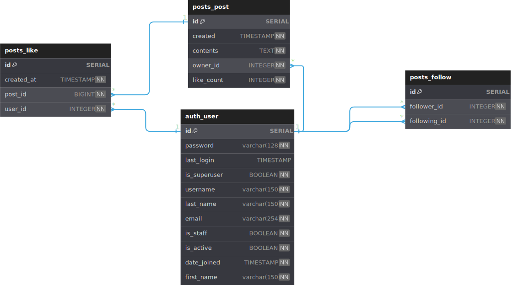

# Twitter API

This is a Django-based REST API project that provides functionality for posts, likes, follows, and user registration.

## Setup Instructions

### 1. Clone the Repository
Download the project by cloning the repository:
```bash
git clone https://github.com/diskrat/twitter-api.git
cd twitter-api
```

### 2. Create Virtual Enviroment 
Create and activate a virtual environment to isolate dependencies:

```bash
# On Linux / macOS 
python3 -m venv venv
source venv/bin/activate

# On Windows
python -m venv .venv
.venv\Scripts\activate
```

### 3. Install Dependencies
Install the required Python packages using `pip`:

```bash
pip install -r requirements.txt
```

### 4. Setup Database
```bash
python manage.py makemigrations
python manage.py migrate
```

### 5. Run Server
```bash
python manage.py runserver
```


### Entity-Relationship Diagram (ERD) 

The overall idea was not running a `count(*)`(the Justin Bieber problem) every time someone runs a `GET /posts/`.
The solution was updating the `like_count` every time someone like/dislike





### Tech choices
I worked with what was given most of it is new to me 
- Mostly used `django.model` [docs](https://docs.djangoproject.com/en/5.2/topics/db/models/);
- [DRF](https://www.django-rest-framework.org/) Guides and API Reference;
- and the [simplejwt plugin for DRF](https://django-rest-framework-simplejwt.readthedocs.io/en/latest/)


### Extra
Used HyperlinkModels to be easy to navigate because some parts are missing for the fully functioning project.

Post only working through context is one of the problems created while I was trying to make it work with minimal work.

Postgres implementation is harder than I thought and I spent too much time trying to understand it.

### Next Steps
- Implement the "Only see posts from people I follow" feature
- Tests
- PostgreSQL as DB
- Frontend Using MaterialUI
- package everything in a Docker compose file